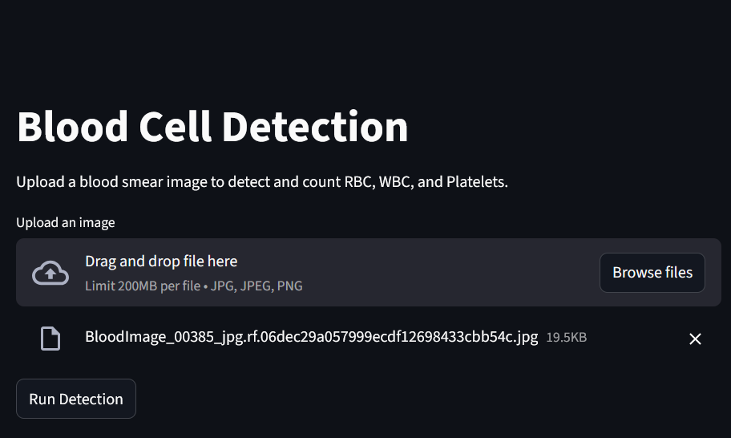
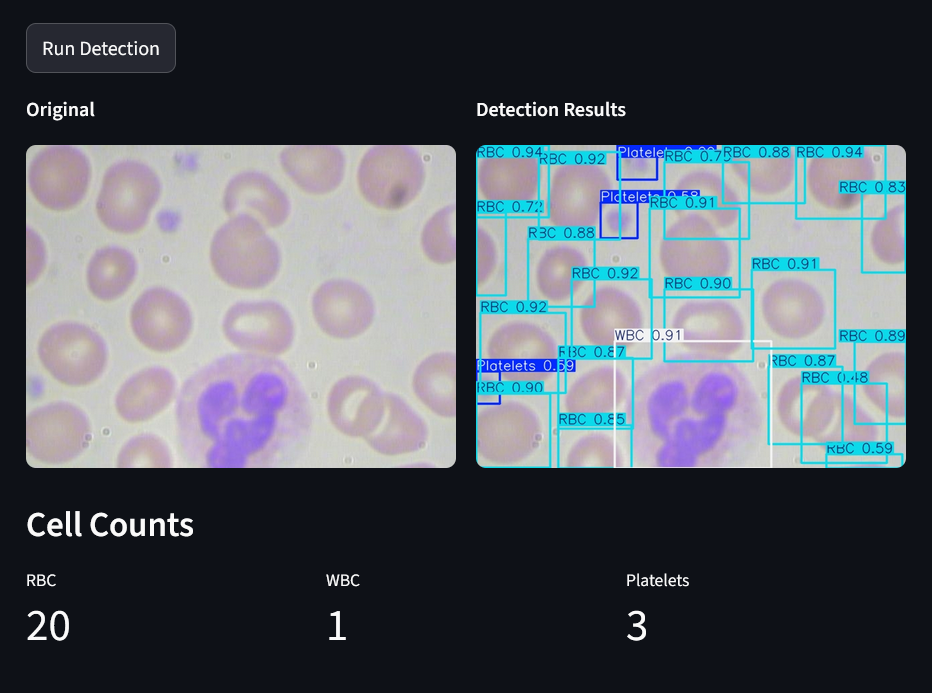

# 🩸 Blood Cell Detection & Counting System

A computer vision application built with **YOLO (Ultralytics)** and **Streamlit** to automate the detection and counting of Red Blood Cells (RBC), White Blood Cells (WBC), and Platelets from microscopic blood smear images.

## 📌 Project Overview
Manual counting of blood cells is time consuming and prone to human error. This project leverages deep learning to provide a fast, automated solution for hematology analysis. By uploading a blood smear image, the system identifies individual cells, draws bounding boxes, and provides a final count of each cell type.

### Key Features:
* **Automated Detection:** Real time identification of RBCs, WBCs, and Platelets.
* **Accuracy:** Powered by the state of the art YOLO object detection model.
* **User Friendly UI:** Clean, intuitive interface built with Streamlit.
* **Dockerized:** Fully containerized for easy deployment and consistent performance across any environment.

---

## 🚀 Installation & Setup

### Using Docker (Recommended)
1. **Clone the repository:**
   ```bash
   git clone [https://github.com/raaja-snd/Blood-Cell-Detection.git](https://github.com/raaja-snd/Blood-Cell-Detection.git)
   cd Blood-Cell-Detection
   ```

2. **Build the image:**
   ```bash
   docker build -t blood-cell-app .
   ```

3. **Run the container:**
   ```bash
   docker run -p 8501:8501 blood-cell-app
   ```
4. Open your browser and navigate to `http://localhost:8501`.

---

## 🛠️ Tech Stack
* **Deep Learning:** YOLO (Ultralytics)
* **Web Framework:** Streamlit
* **Image Processing:** OpenCV, Pillow
* **Containerization:** Docker
* **Logging/Tracking:** MLflow

---

## 🖥️ Usage
1. **Upload:** Drag and drop a microscopic blood smear image (JPG/PNG).
2. **Detect:** Click the **"Run Detection"** button to process the image.
3. **Analyze:** The system will display the original image alongside the annotated version and provide a breakdown of the cell counts.

### Application Screenshots

| 1. Upload Interface | 2. Detection Results |
| :---: | :---: |
|  |  |
| *Easy-to-use drag and drop interface* | *Automated bounding boxes and classification* |


---

## 👤 Author
 [**Raaja Selvanaathan Datchanamourthy**](https://github.com/raaja-snd)

---

### 📝 License
This project is licensed under the MIT License.